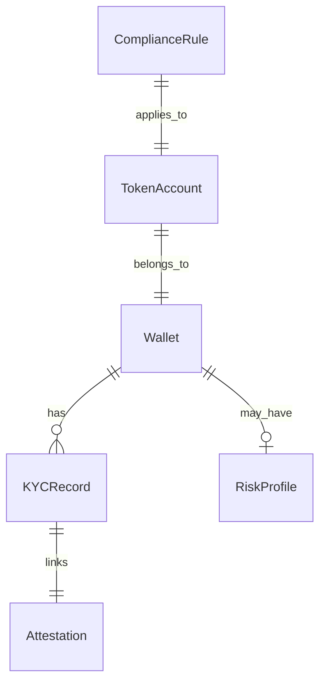

# Solana KYC Compliance SDK

### Purpose
A compliance layer designed to bridge institutional KYC/AML processes with Solana’s token infrastructure.

### Key Features
- **On-chain Whitelist Registry:** Secure, transparent, and auditable list of verified addresses.
- **SDK Integration:** Simple TypeScript client for wallet-level verification and token gating.
- **Regulatory Alignment:** Eases the adoption of compliant Real-World Asset issuance.

### Quick Start
```bash
# Clone the repo
git clone https://github.com/Gitdigital-products/solana-kyc-compliance-sdk.git
cd solana-kyc-compliance-sdk

# Build the Rust program
cd programs/compliance_registry
cargo build-bpf

# Build the SDK
cd ../../sdk/typescript
npm install && npm run build
Open-source SDK for enforcing KYC/AML compliance directly at the token level on Solana using Token Extensions (Transfer Hook &amp; Permanent Delegate). Includes a Rust on-chain program, TypeScript SDK, and Compliance Registry for institutional-grade Real-World Asset (RWA) issuance.

```mermaid
graph LR
    Wallet -->|registerWallet()| SDK
    SDK -->|verifyAttestation()| KYCRegistry
    SDK -->|getRiskScore()| RiskEngine
    SDK -->|transfer()| SolanaProgram
```

sequenceDiagram
    participant UserWallet
    participant SDK
    participant KYCRegistry
    participant RiskEngine
    participant SolanaProgram
```mermaid
    UserWallet->>SDK: transferRequest
    SDK->>KYCRegistry: checkKYC
    SDK->>RiskEngine: getRiskScore
    SDK->>SolanaProgram: invokeTransferHook
    SolanaProgram-->>UserWallet: mint/transferToken
```

## ER Diagram compliance SDK scheme 

# Solana KYC Compliance SDK

**Mission:** This is an open-source SDK that enables institutions to enforce KYC/AML compliance directly on-chain for Real-World Asset (RWA) tokens using Solana Token Extensions. It is built for token issuers,合规 teams, and institutional developers. *(Stage: Beta / In Development)*

## 🎯 PHASE 1 - CLARITY & SCOPE
**Parent Initiative:** Org-wide Clarity & Core Infra
**Objective:** Formalize the project's mission and establish robust development workflows to support external contributors and enterprise adoption.

### Immediate Actions:
1.  **Roadmap Alignment:** Confirm if this project is a core revenue driver, a supporting infrastructure piece, or an open-source lead generator.
2.  **Set Up Tracking:** Create scoped GitHub Issues using templates for bugs, feature requests (from the community), and internal tasks.
3.  **Secure Pipeline:** Enhance CI/CD (using internal `Checkout` & `Setup-node`) to run Rust/TS tests, security audits (e.g., `cargo-audit`), and linting on every PR.

**Owner:** *[RickCreator87]*
**Roadmap Link:** See the central organizational roadmap in [gitdigital-products.io](https://github.com/Gitdigital-products/gitdigital-products.io)
# Solana KYC Compliance SDK

**Mission:** **Primary Revenue Driver.** An enterprise-grade SDK that allows financial institutions and RWA issuers to program KYC/AML compliance directly into Solana tokens using Token Extensions. We solve regulatory onboarding for institutional blockchain adoption.

**Stage:** **Beta – Piloting with Launch Partners**

## 🎯 PHASE 1 EXECUTION: CLARITY & CORE INFRA
**This repository is now a defined business unit.**
-   **Owner:** *[Assign: Product Lead]* | **Tech Lead:** *[Assign: Tech Lead]*
-   **Target MVP Launch:** *[Set Date: e.g., Q2 2025]*

### Immediate Actions (This Week):
-   [ ] **Finalize MVP Feature Set:** Lock down v1.0 features (e.g., Transfer Hook, Registry UI, Basic Admin Dashboard).
-   [ ] **Create GitHub Project Board:** Link it here: `[Link to Project Board]`. Scope Epics: `SDK Finalization`, `Pilot Deployment`, `Documentation`.
-   [ ] **Harden CI/CD Pipeline:** Mandatory steps: `cargo test` (Rust), `npm test` (TS), `cargo fmt --check`, `cargo clippy`, and security audit on PR to `main`.

### 📁 Repository Structure & Purpose
-   `/program/` – **Core Business Logic:** The on-chain Solana program (Transfer Hook, Permanent Delegate).
-   `/sdk/` – **Primary Product:** The TypeScript client library for developers to integrate compliance.
-   `/registry/` – **Revenue Feature:** Compliance officer dashboard (future subscription model).
-   `/tests/` – **Quality Assurance:** Integration and unit tests for the entire stack.

**Roadmap & Strategy:** The organizational CEO plan and detailed roadmap are maintained in the central hub: [gitdigital-products.io](https://github.com/Gitdigital-products/gitdigital-products.io).